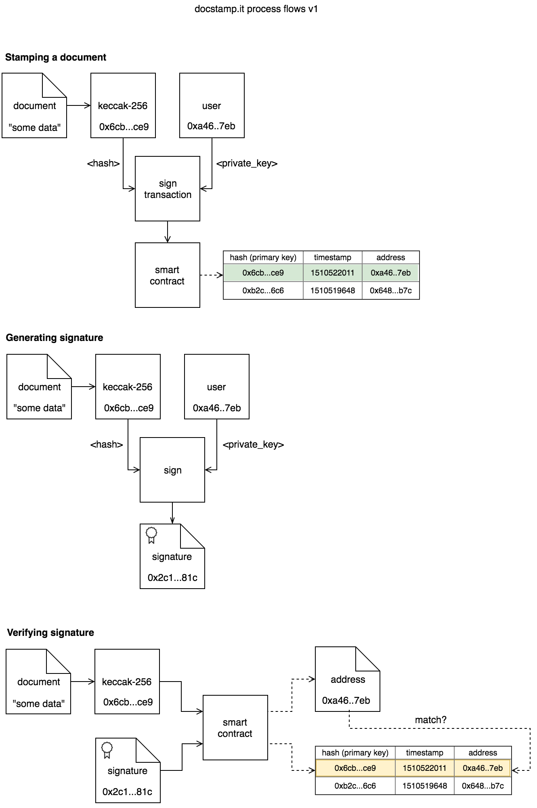

<h1 align="center">
  <br />
  
  <br />
  <br />
  <br />
</h1>

> Document notarization on the [Ethereum](https://ethereum.org/) blockchain.

<a href="https://docstamp.it"></a>

# Demo

**[https://docstamp.it](https://docstamp.it)**

# Architecture



# Test

```bash
truffle test
```

# License

MIT
